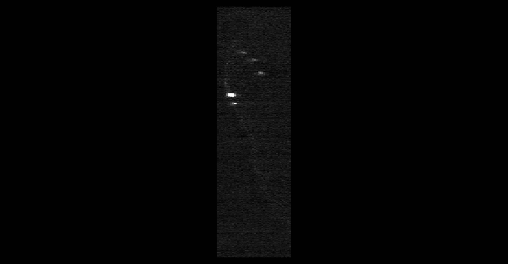
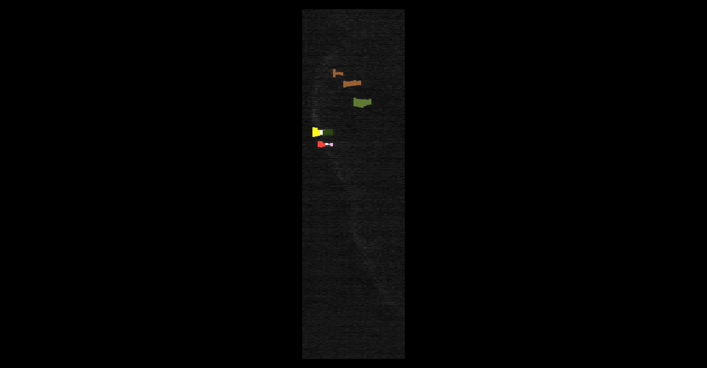
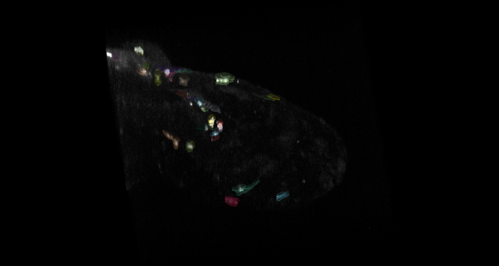

# OIC-136 Zebrafish Microglia

Total hours: 23.5

GitHub Repository: <https://github.com/vaioic/OIC-136_Microglia>

## Authorship and Methods

Research supported by the Optical Imaging Core should be acknowledged and considered for authorship. Please refer to our [SharePoint page](https://vanandelinstitute.sharepoint.com/sites/optical/SitePages/Acknowledgements-and-Authorship.aspx) for guidelines.

Please include our RRID in the methods section for any research supported by the OIC. RRID:SCR_021968

### Sample Acknowledgement

We thank the Van Andel Institute Optical Imaging Core (RRID:SCR_021968), especially [staff name], for their assistance with [technique/technology]. This research was supported in part by the Van Andel Institute Optical Imaging Core (RRID:SCR_021968) (Grand Rapids, MI).

## Summary of Request

From Request:
>I would like to request the following analyses of microglia from z-stack images of 3 days post-fertilization zebrafish:
>
> 1. Cell numbers
>
> 2. Morphology (quantification of roundness or cellular projections)
>
> 3. Fluorescence intensity

## Brief summary of analysis pipeline

Python-based analysis pipeline that normalized images using [py-clesperanto](https://github.com/clEsperanto/pyclesperanto/tree/main) package, [CellPose v3](https://github.com/MouseLand/cellpose/tree/v3.1.1.2) to segment microglia and [SciKit-Image](https://scikit-image.org) to measure fluorescence intensities and morphology metrics (volume, surface area, and sphericity).

Custom CellPose model to improve segmentation and skeleton length measurements will be added once data collection approach is fine tuned.

## Data

3D images of zebrafish brains were collected on the OIC's Andor Spinning Disk Confocal Dragonfly 620.

Images from the Dragonfly are in the Imaris format (.ims). They are a proprietary type of HDF5 image with a pyramidal structure. These images were converted into multi-page tiff files with ImageJ prior to analysis (open in ImageJ and then save as a tiff).

Three conditions: control morpholino (MO) (n=8), *gnas*-MO 1ng (n=8), and *gnas*-MO 2ng (n=9)

Challenges of dataset: large z-spacing gives boxy objects in z that are less representative of the microglia; high background in some images gives a low signal to noise ratio that is challenging to correct for.

## Analysis Pipeline

To correct changes in illumination in Z and to increase the signal to background ratio, images were normalized by the mean intensity of the image and then a white top hat filter with `radius=10` was applied.

Example image before normalization and background subtraction (view in ZX; side view):


Example image after normalization and background subtraction (view in ZX; side view):


Normalized images were then passed into CellPose to detect microglia using the following settings:

```python
model = models.Cellpose(gpu=True,model_type='cyto3') # model_type='cyto' or 'nuclei' or 'cyto2' or 'cyto3'
channels =[[0,0]]
masks, _, _, _ = model.eval(norm_imgs, diameter=70, channels=channels, z_axis=0,stitch_threshold=0.2,flow_threshold=0.5,cellprob_threshold=1.0)
```

Only the masks were kept, the three other outputs were left blank (i.e. `_, _, _`).

Example of masks from CellPose:





[Scikit-image](https://scikit-image.org), a python package for analyzing and quantifying images, was used for measuring the volume and surface area of the lesion annotations. The label values (Object IDs) and volume were acquired with the `skimage.measure.regionprops_table` module. Surface area was calculated with `skimage.measure.marching_cubes` and `skimage.measure.mesh_surface_area`.

To calculate the Sphericity of the lesion annotations, the following equation was used:

($\pi$^1/3^( (6 * Volume)^2/3^) ) / Surface Area

The numerator is the surface area of a perfect sphere with the same volume as the object, the denominator is the surface area of the object. The more "wrinkled" the surface of the object, the larger the surface area leading to a smaller ratio value. Sphericity = 1 is a perfect sphere, closer to 0 means less perfect.

Scikit-Image's `segmentation.clear_border` and `morphology.remove_small_objects` were used to remove any objects touching the image border or smaller than a volume of 2000 pixels. The volume threshold was determined through a brief screening of unfiltered masks and measurements. *Note: it is probable that small, false detections are still present that are between 2000 pixels^3 and the smallest real microglia detection*

Scikit-Image's `measure.regionprops_table` was run on the filtered masks to measure the volume (in pixels) and fluorescence intensity min, max, and mean from the original image. Volume was converted to scale by multiplying the volume in pixels to the voxel scale (4.55 *0.3* 0.3).

[Pandas](https://pandas.pydata.org/docs/index.html), a python package for handling data frames, was used to compile and export the final data frame of measurements as a csv.

## Output

Example of data exported:

|    |   label |   area |   intensity_mean |   intensity_min |   intensity_max |   Volume (um^3) |   Surface_Area (um^2) |   Sphericity |
|---:|--------:|-------:|-----------------:|----------------:|----------------:|----------------:|----------------------:|-------------:|
|  0 |       1 |   4692 |          119.693 |              89 |             173 |         1934.2  |               1825.42 |     0.411267 |
|  1 |       2 |   5372 |          142.359 |              82 |             300 |         2214.52 |               1633.39 |     0.503015 |
|  2 |       5 |   2761 |          116.97  |              83 |             164 |         1138.18 |               1208.15 |     0.436351 |
|  3 |       6 |   3651 |          126.423 |              82 |             219 |         1505.07 |               1193.5  |     0.532147 |
|  4 |       8 |  19592 |          117.292 |              69 |             166 |         8076.5  |               4817.6  |     0.404081 |

For each image, the normalized/background subtracted image and filtered masks, and measurements were exported as .tiff and .csv, respectively, into their own sub folders (norm_imgs, masks, and measurements). Each file is named with the following pattern: normalized_*image_name*.tiff, filtered_masks_*image_name*.tiff, and measurements_*image_name*.csv

All data are located at \projects\paradakusz\vari-core-generated-data\OIC\OIC-136_Microglia on VAI's network.

## Notes

This was a pilot study to test feasibility of analysis and compare CellPose and conventional analysis approaches. CellPose will have greater flexibility to detect the fine branching that can come off of microglia and be trained to ignore variable background noise more reliably. A custom CellPose model will be trained on future data collected with a finer Z-spacing. Additionally, skeleton length will be added to the analysis pipeline as an another metric for comparing and classifying the different states of microglia.

### Optional Analyses - what other information could you get from this data

- A Sholl analysis could be added to assess branching of microglia
- Nearest neighbor distances could be calculated to assess clustering and distribution
